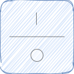

# ha-cover_control
Virtual control for covers in HomeAssistant!

When I bought my first IKEA Fyrtur I quickly realized that the cover is a lot longer than my window, thus open (100%) and closed (0%) would make it almost touch the floor or ceiling. To mitigate this I connected the Fyrtur to HomeAssistant through DeConz, started writing automations, configured input_booleans for different motions, states showing new open/closed values etc. I finally ended up with 11 new entities which had to be kept up to date ([here is the original set up](Cover-control-in-native-HA.md)). To keep my HomeAssistant system a bit slimmer I decided to write this as a custom component, and here we are!

## What does it do?!
Cover control is a virtual cover remote, but powered with all the features of HomeAssistant!

Cover control can be configured to a new `open` and `closed` value to set specific boundaries how high and low the cover can go.

Cover control listens to `open` and `close` events, and keeps opening or closing until the desired max or min value is reached. If your cover is already in motion and you press the same button again, the cover stops. If the cover is in motion and you press the other button, the cover changes directions, just like the original IKEA cover remote!

Cover control can be set up to listen to a multitude of different remotes. Cover control can also be configured to synchronize open and close for multiple blinds, regardless of brand! As a bonus feature, cover control can listen to any HomeAssistant event, as long as it contains an `id` and optionally an `event` in the data section.

## Installation

### HACS
1. Go to integrations
2. Press the dotted menu in the top right corner
3. Choose custom repositories
4. Add the URL to this repository
5. Choose category `Integration`
6. Click add

## Configuration
Set up the sensor in `configuration.yaml`:
~~~~
# Example configuration.yaml entry
cover_control:
  name: My cover
  cover: cover.my_cover
  cover_position: sensor.my_cover_position
  open_at: 90
  closed_at: 30
  open:
    entity: tradfri_open_close_remote
    data: 1002
  close:
    entity: tradfri_open_close_remote
    data: 2002
~~~~

### Options
| Name           | Type                    | Default             | Description
| ----           | ----                    | -------             | -----------
| name           | string                  | The id of the cover | Friendly name
| cover          | entity_id               | **Required**        | The entity_id of an existing cover
| cover_position | entity_id               | **Required**        | The entity_id of an existing sensor whose state is the current position of the cover. See example below
| open_at        | int between 0 and 100   | **Required**        | Percentage determining when cover is open
| closed_at      | int between 0 and 100   | **Required**        | Percentage determining when cover is closed
| open           | [Event](#event-options) | **Required**        | Event which triggers opening of the cover
| close          | [Event](#event-options) | **Required**        | Event which triggers closing of the cover

### Event options
| Name   | Type   | Default      | Description
| ----   | ----   | -------      | -----------
| type   | string | deconz_event | Event to listen for
| entity | string | undefined    | The entity that triggered the event. Matches `data.id` of an event in HomeAssistant
| data   | string | **Required** | The payload of the event. Matches `data.event` of an event in HomeAssistant

### Sensor to show cover position
~~~
- platform: template
  sensors:
    cover_position:
      friendly_name: "Cover position"
      unit_of_measurement: "percent"
      value_template: "{{ state_attr('cover.my_cover_id_here', 'current_position') }}"
~~~

## Examples

### Multiple covers connected to the same remote
~~~
cover_control:
  - name: My cover
    cover: cover.my_cover
    cover_position: sensor.my_cover_position
    open_at: 90
    closed_at: 30
    open:
      entity: my_remote
      data: 1002
    close:
      entity: my_remote
      data: 2002
  - name: My second cover
    cover: cover.my_cover2
    cover_position: sensor.my_cover2_position
    open_at: 90
    closed_at: 30
    open:
      entity: my_remote
      data: 1002
    close:
      entity: my_remote
      data: 2002
~~~
